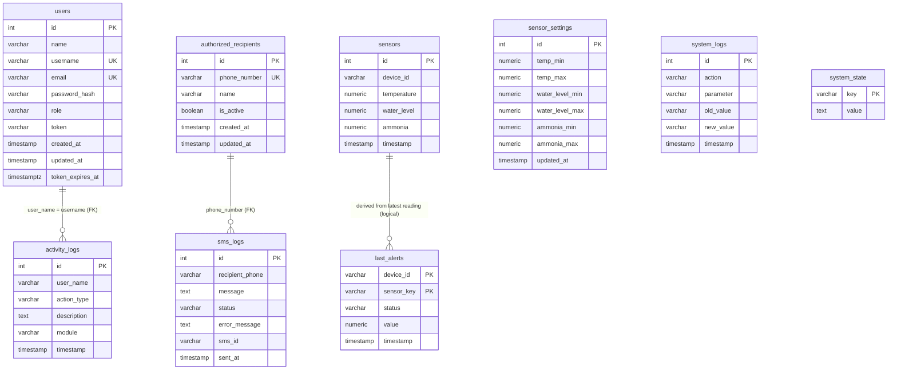

# CRAYvings Monitoring System - Entity Relationship Diagram

> Database: `crayvings_monitoring_system_db` (PostgreSQL)

## Mermaid ERD

## Notes on Relationships

- **Foreign keys (enforced):**
  - `activity_logs.user_name` → `users.username` (`ON UPDATE CASCADE ON DELETE RESTRICT`). Audit trail records the acting user's username.
  - `sms_logs.recipient_phone` → `authorized_recipients.phone_number` (`ON DELETE CASCADE`). Deleting a recipient also removes their SMS history.
- `last_alerts` is keyed by `(device_id, sensor_key)` so each device keeps its own alert state. It is *derived* from the latest `sensors` reading by the alert engine — no FK (a `sensors` row is a single reading, not a 1:1 match).
- `users.token` + `users.token_expires_at` implement 24-hour session authentication (validated in `server.cjs`).
- `sensor_settings`, `system_state`, and `system_logs` are standalone tables (no relationships).
